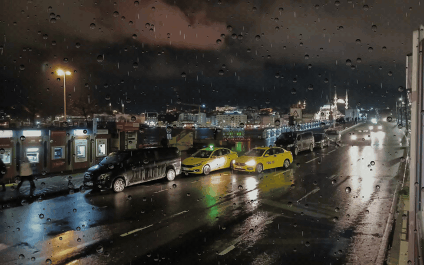
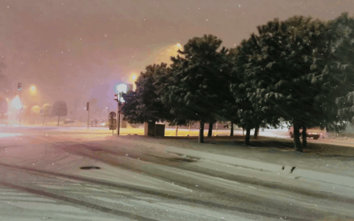

# Sokak

A little weather. A little home.

Sokak is a native macOS menu bar app for watching Istanbul weather from behind a window: rain beads hit the glass, join together, and run down it; snow drifts at different depths outside a softly frosted pane. Keep working through a transparent overlay, or sit with a real Istanbul street photograph and soft stereo ambience.



Rain preview: actual renderer output over Furkan Akkurt's [rainy Galata Bridge photograph](https://commons.wikimedia.org/wiki/File:Rainy_night_Galata_Bridge_area_Istanbul_2026.jpg). Cropping, dimming, defocus, refraction and weather added; this adaptation is [CC BY-SA 4.0](https://creativecommons.org/licenses/by-sa/4.0/).



Snow preview: actual renderer output over Maurice Flesier's [Bağcılar photograph](https://commons.wikimedia.org/wiki/File:A_snowy_evening_in_Ba%C4%9Fc%C4%B1lar,_Istanbul.jpg). Cropping, dimming, frost and weather added; this adaptation is [CC BY-SA 4.0](https://creativecommons.org/licenses/by-sa/4.0/). Both previews are silent; the app has optional ambience.

## Get the app

**[Download Sokak for Mac](https://github.com/biblo454647/sokak/releases/latest)** · **[Browse the source](https://github.com/biblo454647/sokak)** · **[Report an issue](https://github.com/biblo454647/sokak/issues)**

Download **Sokak-1.3.0-universal.zip** from the release page. Unzip it and move **Sokak.app** into `~/Applications`, then open it. No Homebrew or separate runtime installation is needed. Sokak is free and open source.

**Already using 1.2 or earlier?** Install 1.3 once from the ZIP; those older versions do not have an updater. From 1.3 onward, click **Updates** at the bottom of the menu, then **Install Update → Install and Relaunch**. Your settings and imported photographs are preserved. Optional automatic checks are in **A few little details**; installation always stays your choice. Updates come from this repository's GitHub Releases through a signed feed and signed archives. No GitHub sign-in is needed. Keep the app in a writable Applications folder, rather than running from the ZIP or a read-only disk image.

**Compatibility:** macOS 13 Ventura or later, Apple Silicon or Intel, with Metal graphics. The two architectures are included in one app. Runtime testing has covered Apple Silicon; physical Intel and older macOS versions still require validation.

**Opening the download:** the current build is ad-hoc signed and **not Apple Developer ID signed or notarized**. macOS may block its first launch. If you trust the download and your device policy allows it, use **System Settings → Privacy & Security → Open Anyway** after attempting to open it. Managed Macs may require IT approval. See [Apple's guidance](https://support.apple.com/en-gb/102445).

## Use it

- Click the little cloud in the top-right menu bar. Choose **Rain**, **Snow**, or **Mist**, then **Let the weather in**.
- **Over my windows** leaves the screen interactive. **An Istanbul street** covers the selected display with a photograph and catches mouse clicks; press **Escape** to leave it.
- Tune intensity, wind, sound, volume, dimming, display selection, and a 15/30/60/120-minute timer.
- **Window glass** is on by default. Hundreds of small beads stay pinned to the pane. A few heavy drops merge and glide down slowly; new droplets arrive in irregular showers. Rain outside changes its position and depth each time it crosses the screen. Snow has distant flakes, soft close flakes, occasional contact with the pane, and light frost at the edges.
- **Focus** keeps the glass sharp while softening the photograph behind it. Slide toward **Street** for a clearer view or toward **Soft** for a close focus on the glass. Turn Window glass off under **A few little details** for weather alone.
- Photograph mode bends the street and the falling weather through each water bead. Desktop mode shows droplets, trails, and highlights over your work; it cannot bend other apps' pixels because Sokak never captures the screen.
- The library opens with photographs suitable for the selected weather. Rain uses wet streets or overcast views; snow uses real winter photographs. **All streets** includes sunny images. Explicitly choosing an incompatible photo turns automatic matching off, so your choice stays put; switch matching back on in Details whenever you want. Import your own JPEG, PNG, HEIC, or TIFF to add a personal view.
- **⌃⌥⌘S** toggles the session; **⌃⌥⌘M** toggles sound. Right-clicking the menu-bar cloud also toggles the session. A shortcut conflict is reported in the menu; the menu controls always remain available.
- **Current display** means the display containing the pointer when the session starts; it stays there until the session is stopped. An explicit display or all displays can also be selected.
- Low power uses 30 fps; standard uses 60 fps. macOS Low Power Mode also selects 30 fps. Reduce Motion makes the weather slower and less dense.
- Sessions pause for screen sleep, system sleep, and session deactivation. They do not restart themselves or start at login.

The app always launches paused. The timer fades sound out and removes the overlay. Open the **…** menu to quit.

## The streets

Fifteen original photographs are bundled offline, from 2,560 × 1,920 up to 6,016 × 4,000 pixels. New in 1.3: Galata Bridge on a rainy night, Ayasofya in the rain, a quiet wet courtyard, and a grey day on the Bosphorus. The library also includes Balat, İstiklal in snowfall, Sultanahmet in snow, Bağcılar, Bahçelievler and Göztepe. There is no artificial upscaling. These are still photographs, not live cameras or AI reconstructions. Sunny photographs remain available in All streets, but are excluded from automatic rain matching.

Photographers, source links, exact resolutions, file hashes, and licenses are recorded in [scenes.json](Resources/scenes.json) and [Photograph Credits](Resources/PHOTO-CREDITS.md). Originals remain unchanged; cropping, dimming, defocus, refraction and weather are applied at display time. CC BY-SA photographs and any distributed adaptations retain their respective licenses.

Audio is original synthesized rain and wind, not location recordings. Rain combines a muted outdoor bed with soft, close taps against glass. It uses quiet stereo beds, seamless-loop preparation, and gradual volume changes. Individual visual impacts are not synchronized to the ambient audio loop. There are no sudden thunderclaps or flashing lightning.

## Privacy and permissions

Weather, photographs and sound work offline. The app does not request screen capture, Accessibility, microphone, camera or location access, and has no account, analytics or login service. The transparent overlay does not read pixels from other apps. Update checks contact GitHub only when you click Updates or enable automatic checks; downloads use GitHub's release delivery servers. Sparkle system profiling and automatic installation are disabled. External help/source links open only when clicked. The updater respects normal macOS and managed-device installation policies.

Preferences live in the standard `com.sokakapp.Sokak` user-defaults domain. Imported photographs are copied to `~/Library/Application Support/Sokak/Imports`; Sokak never uploads them, and the build and self-test exclude them. Remove the app to uninstall. You can keep your imports and preferences for a later reinstall or remove them separately.

## Build and verify

Apple Command Line Tools with a recent Swift compiler are sufficient. The build downloads the pinned [Sparkle 2.9.6](https://github.com/sparkle-project/Sparkle/releases/tag/2.9.6) framework, verifies its SHA-256, and bundles it. Later builds can reuse the cached archive. No Xcode project-generation step is needed.

```sh
bash scripts/build.sh
swiftc -swift-version 5 Sources/Core.swift Tests/CoreTests.swift -o .build/core-tests
.build/core-tests
swiftc -O -swift-version 5 Sources/Core.swift Sources/GlassSimulation.swift Tests/GlassTests.swift -o .build/glass-tests
.build/glass-tests
dist/Sokak.app/Contents/MacOS/Sokak --self-test docs/qa
python3 scripts/verify_assets.py
```

The build cross-compiles `arm64` and `x86_64`, combines them, creates the app icon, embeds assets and license notices, ad-hoc signs the bundle, verifies its integrity, and produces a ZIP. The self-test renders bundled photographs and transparent frames through the actual Metal pipelines, checks audio decoding, and exports the native menu and library views. It excludes personal imports and never captures the desktop. Generated reports stay in the ignored `docs/qa/` directory.

Append `--motion-preview` to the app self-test command to export ten-second rain and snow MP4s from the actual renderer. Surface-water tests check merging, mostly pinned beads, slow runoff, trails, distinct session patterns, pause recovery, bounded particle counts, and equivalent simulation at 30/60 fps. Existing preferences are preserved; sunny automatic rain selections migrate to a suitable photograph.

Photo regeneration uses the Python standard library: `python3 scripts/fetch_scenes.py`. Audio regeneration additionally requires NumPy and FFmpeg: `python3 scripts/make_audio.py`. All photographs and audio are committed; only the first Sparkle dependency fetch needs Internet access for a normal build.

For Developer ID distribution, sign the app and nested Sparkle components with your Developer ID identity, remove the ad-hoc-only library-validation exception, notarize, staple and verify before packaging. The current ad-hoc build needs that per-app exception to load the upstream-signed Sparkle framework because it has no matching Team ID. It does not change system security settings. No private signing material is included in this repository.

Maintainers: see [Releasing updates](docs/RELEASING.md) for the signed-feed workflow. Forks must use their own repository URL and update signing key.

## License and contributing

Source code, the icon, and original synthesized audio use the [MIT license](LICENSE). You can use, modify, and redistribute them under its terms. The photographs and the preview image retain their separate Creative Commons licenses; see [Third-party notices](THIRD_PARTY_NOTICES.md).

Bug reports and improvements are welcome. See [Contributing](CONTRIBUTING.md), [Project metadata](PROJECT.md), and [Validation](docs/VALIDATION.md) for development and release details.
