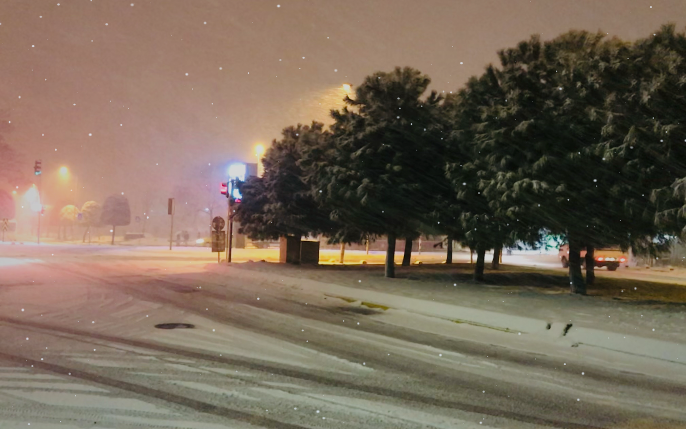

# Sokak

A little weather. A little home.

Sokak is a native macOS menu bar app for a quiet Istanbul escape: layered rain, drifting snow, slow mist, and soft stereo ambience. Keep working through a transparent overlay, or sit with a real Istanbul street photograph.



Preview photograph: Maurice Flesier, [CC BY-SA 4.0](https://creativecommons.org/licenses/by-sa/4.0), [original source](https://commons.wikimedia.org/wiki/File:A_snowy_evening_in_Ba%C4%9Fc%C4%B1lar,_Istanbul.jpg). Screenshot adaptation with display cropping, dimming, and rendered snowfall; this adapted image is also CC BY-SA 4.0.

## Get the app

**[Download Sokak for Mac](https://github.com/biblo454647/sokak/releases/latest)** · **[Browse the source](https://github.com/biblo454647/sokak)** · **[Report an issue](https://github.com/biblo454647/sokak/issues)**

Download **Sokak-1.1.0-universal.zip** from the release page. Unzip it and open **Sokak.app**. You can keep it in `~/Applications`. No installer, administrator helper, Homebrew, or runtime download is needed. Sokak is free and open source.

**Compatibility:** macOS 13 Ventura or later, Apple Silicon or Intel, with Metal graphics. The two architectures are included in one app. Runtime testing has covered Apple Silicon; physical Intel and older macOS versions still require validation.

**Opening the download:** the current build is ad-hoc signed and **not Apple Developer ID signed or notarized**. macOS may block its first launch. If you trust the download and your device policy allows it, use **System Settings → Privacy & Security → Open Anyway** after attempting to open it. Managed Macs may require IT approval. See [Apple's guidance](https://support.apple.com/en-gb/102445).

## Use it

- Click the little cloud in the top-right menu bar. Choose **Rain**, **Snow**, or **Mist**, then **Let the weather in**.
- **Over my windows** leaves the screen interactive. **An Istanbul street** covers the selected display with a photograph and catches mouse clicks; press **Escape** to leave it.
- Tune intensity, wind, sound, volume, dimming, display selection, and a 15/30/60/120-minute timer.
- Choose a photograph from the library, filter for winter, or import your own JPEG, PNG, HEIC, or TIFF. Snow automatically chooses a winter image when seasonal matching is on. Manually chosen photographs stay selected until you change weather.
- **⌃⌥⌘S** toggles the session; **⌃⌥⌘M** toggles sound. Right-clicking the menu-bar cloud also toggles the session. A shortcut conflict is reported in the menu; the menu controls always remain available.
- **Current display** means the display containing the pointer when the session starts; it stays there until the session is stopped. An explicit display or all displays can also be selected.
- Low power uses 30 fps; standard uses 60 fps. macOS Low Power Mode also selects 30 fps. Reduce Motion makes the weather slower and less dense.
- Sessions pause for screen sleep, system sleep, and session deactivation. They do not restart themselves or start at login.

The app always launches paused. The timer fades sound out and removes the overlay. Open the **…** menu to quit.

## The streets

Eleven original photographs are bundled offline, from 2,592 × 1,944 up to 6,016 × 4,000 pixels. There is no artificial upscaling. The library includes Balat's lanes and a neighbourhood café, the İstiklal tram in real snowfall, Sultanahmet in snow, Bağcılar by day and on snowy evenings, Bahçelievler's D100 road, and a wet Göztepe street. These are photographs, not live cameras or AI reconstructions. They retain their original lighting; adding weather does not reconstruct the street in 3D or make sunny surfaces physically wet.

Photographers, source links, exact resolutions, file hashes, and licenses are recorded in [scenes.json](Resources/scenes.json) and [Photograph Credits](Resources/PHOTO-CREDITS.md). Originals remain unchanged; aspect-fill cropping and weather are applied at display time. CC BY-SA photographs and any distributed adaptations retain their respective licenses.

Audio is original synthesized rain and wind, not location recordings. It uses quiet stereo beds, random rain impacts, seamless-loop preparation, and gradual volume changes. There are no sudden thunderclaps or flashing lightning.

## Privacy and permissions

No screen capture, Accessibility access, microphone, camera, location, network connection, analytics, account, browser extension, or background service is required. The overlay is a transparent native window; it does not read pixels from other apps. External help/source links only open when clicked. This app does not circumvent restrictions on a managed Mac.

Preferences live in the standard `com.sokakapp.Sokak` user-defaults domain. Imported photographs are copied to `~/Library/Application Support/Sokak/Imports`; Sokak never uploads them, and the build and self-test exclude them. Remove the app to uninstall. You can keep your imports and preferences for a later reinstall or remove them separately.

## Build and verify

Apple Command Line Tools with a recent Swift compiler are sufficient. There are no third-party app dependencies and no Xcode project-generation step.

```sh
bash scripts/build.sh
swiftc -swift-version 5 Sources/Core.swift Tests/CoreTests.swift -o .build/core-tests
.build/core-tests
dist/Sokak.app/Contents/MacOS/Sokak --self-test docs/qa
python3 scripts/verify_assets.py
```

The build cross-compiles `arm64` and `x86_64`, combines them, creates the app icon, embeds assets and license notices, ad-hoc signs the bundle, verifies its integrity, and produces a ZIP. The self-test renders bundled photographs and transparent frames through the actual Metal pipelines, checks audio decoding, and exports the native menu and library views. It excludes personal imports and never captures the desktop. Generated reports stay in the ignored `docs/qa/` directory.

Photo regeneration uses the Python standard library: `python3 scripts/fetch_scenes.py`. Audio regeneration additionally requires NumPy and FFmpeg: `python3 scripts/make_audio.py`. All assets are already committed, so normal builds need neither dependency nor Internet access.

For Developer ID distribution, use a valid **Developer ID Application** identity with hardened runtime, submit the ZIP to Apple's notary service, staple the accepted ticket to the app, verify with `spctl`, and package again. No signing identity is included in this repository. The current download is unnotarized; managed devices may require allowlisting even after notarization.

## License and contributing

Source code, the icon, and original synthesized audio use the [MIT license](LICENSE). You can use, modify, and redistribute them under its terms. The photographs and the preview image retain their separate Creative Commons licenses; see [Third-party notices](THIRD_PARTY_NOTICES.md).

Bug reports and improvements are welcome. See [Contributing](CONTRIBUTING.md), [Project metadata](PROJECT.md), and [Validation](docs/VALIDATION.md) for development and release details.
